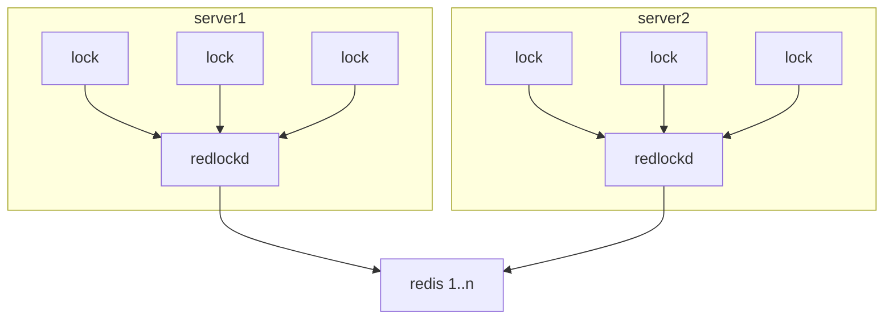

# skynet-redlock
Distributed locks with Redis
https://redis.io/topics/distlock
# 框架设计

# 特性
1. 实现跨服务、跨节点skynet.queue
2. 不会因为调用方代码异常、网络瞬断等原因产生死锁
3. redis集群高可用，不会因为部分机器故障导致分布式锁无法提供服务

# 设计要点
1. 通过redis lua脚本对资源原子操作，使用evalhash降低通信成本
2. 每把锁用uuid识别，锁不能被其他请求uuid释放，保证互斥性
3. 锁需要有超时机制，不会因为占有锁的程序问题或网络异常导致锁一直被占有
4. redlockd对当前锁进行续命，知道业务逻辑处理完毕，主动释放。防止执行时间比较久的业务超时被释放。
5. 调用锁的服务被kill,gc将通知redlockd释放锁
6. redlockd管理请求锁个数会有限制，防止redlockd gc时间操过锁超时时间，导致续命不及时

